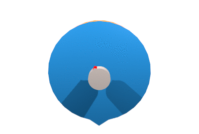
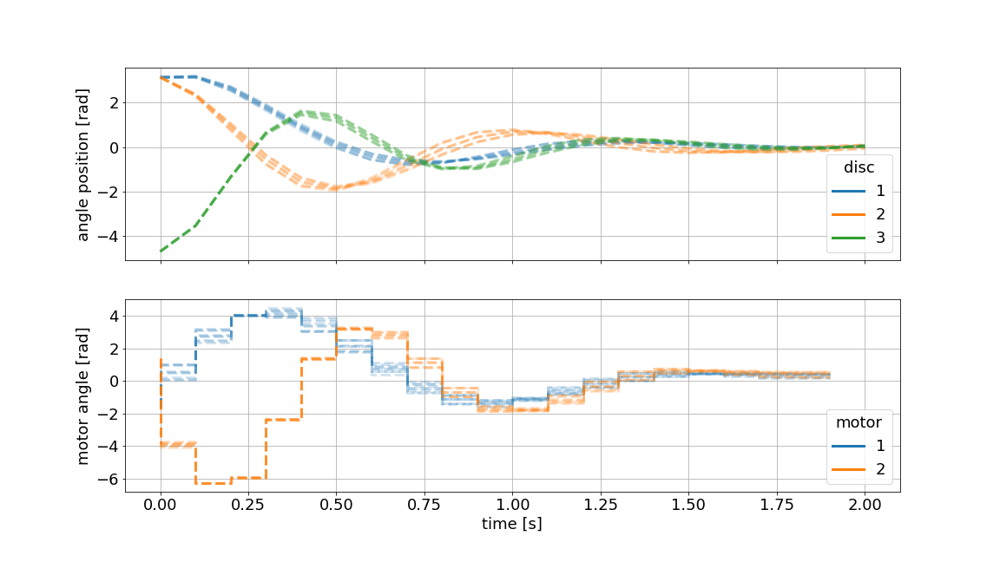

Overview
========

Welcome to "**do-mpc**", an comprehensive toolbox for **robust Model Predictive Control**.
Among others, "**do-mpc**" has the following features:

* Robust multi-stage MPC

* Non-linear and economic MPC (NMPC / EMPC)

* DAE support

* A modular design, completed with state-of-the-art DAE simulator and state-estimation.

* Moving Horizon Estimation (MHE), as well as Extended Kalman Filter for state-estimation.

* An intuitive interface

* Low-level interface and integration with Matplotlib for fully customizable, publication ready graphics and animations.

* Comprehensible python code for easy customizability

Structure
*********
One of the main features of "**do-mpc**" is the modular structure. The tool consists of the the MPC optimizer, the simulator and the estimator
building blocks, which are all derived from a previously configured model.
In many cases the user will be using all three elements, the optimizer, simulator and estimator in a setup as depicted below:

.. image:: static/do_mpc_flow_sheet.png

It is, however, also possible to use blocks individually, e.g. when dealing with Hardware-in-the-Loop (HiL) or pure estimation tasks.

Next steps
**********

We suggest you start by skimming over the selected examples below to get an first impression of the above mentionned features.
A great further read for interested viewers is the `getting started`_ page, where we show how to setup "**do-mpc**" for the
robust control task of a triple-mass-spring system.

.. _getting started: getting_started.ipynb

Robust Multi-stage MPC
**********************
We showcase an example, where the control task is to regulate the rotating triple-mass-spring system as shown below:

.. image:: anim_disc_3d_uncontrolled.gif

Once excited, the uncontrolled system takes a long time to come to a rest.
To incluence the system, two steper motors are connected to the outermost discs via springs.
The designed controller will result in something like this:

Assume, we have modeled the system from first principles and identified the parameters in an experiment.
We are especially unsure about the exact value of the inertia of the masses.
With Multi-stage MPC, we can define different scenarios e.g. :math:`\pm 10\%` for each mass and predict as well as optimize multiple state and input trajectories.
This family of trajectories will always obey to set constraints for states and inputs and can be visualized as shown below:

