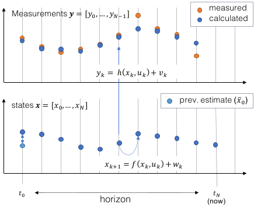

***********************************
Basics of moving horizon estimation
***********************************

**Moving horizon estimation** is an optimization-based state-estimation technique where **the current state of the system is inferred based
on a finite sequence of past measurements**.
In many ways it can be seen as the counterpart to **model predictive control (MPC)**, which we are describing in our `MPC`_ article.

In comparison to more traditional state-estimation methods, e.g. the **extended Kalman filter (EKF)**,
MHE will often outperform the former in terms of estimation accuracy.
This is especially true for non-linear dynamical systems, which are treated rigorously in MHE and where
the EKF is known to work reliably only if the system is almost linear during updates.

Another advantage of MHE is the possible incorporation of further constraints on estimated variables.
These can be used to enforce physical bounds, e.g. fractions between 0 and 1.

All of this comes at the cost of additional computational complexity.
**do-mpc** mitigates this disadvantage through an efficient implementation which allows for very fast MHE estimation.
Oftentimes, for moderately complex non-linear systems (~10 states) the **do-mpc** will run at 10-100Hz.

System model
============

The system model plays a central role in MHE.
**do-mpc** enables state-estimation for continuous and discrete-time nonlinear systems.
For the continuous case, the system model is defined by

.. math::

    \dot{x}(t) = f(x(t),u(t),z(t),p(t),p_{\text{tv}}(t))+w(t), \\
    y(t) = h(x(t),u(t),z(t),p(t),p_{\text{tv}}(t))+v(t),

and for the discrete-time case by

.. math::

    x_{k+1} = f(x_k,u_k,z_k,p_k,p_{\text{tv},k})+w_k, \\
    y_k = h(x_k,u_k,z_k,p_k,p_{\text{tv},k})+v_k.

The state of the systems are given by :math:`x(t),x_k`, the control inputs by :math:`u(t),u_k`,
algebraic states by :math:`z(t),z_k`, (possibly uncertain) parameters by :math:`p(t),p_k`,
time-varying (but known) parameters by :math:`p_{\text{tv}}(t),p_{\text{tv},k}` and measurements by :math:`y(t),y_k`, respectively.
The time is denoted as :math:`t` for the continuous system and the time steps for the discrete system are indicated by :math:`k`.

Furthermore, we assume that the dynamic system equation is disturbed by additive (Gaussian) noise :math:`w(t),w_k`
and that we experience additive measurement noise :math:`v(t), v_k`.
Note that **do-mpc** allows to activate or deactivate process and measurement noise explicitly for individual variables,
e.g. we can express that inputs are exact and potentially measured states experience a measurement disturbance.

Moving horizon estimation problem
=================================

For the case of continuous systems, trying to solve the estimation problem directly is in the general case computationally intractable
because it is an infinite-dimensional problem.
**do-mpc** uses a full discretization method, namely `orthogonal collocation`_,
to discretize the OCP.
This means, that both for continuous and discrete-time systems we formulate a discrete-time optimization problem to solve the estimation problem.

Concept
*******

The fundamental idea of moving horizon estimation is that the current state of the system is inferred based
on a finite sequence of :math:`N` past measurements, while incorporating information from the dynamic system equation.
This is formulated as an optimization problem, where the finite sequence of states, algebraic states and inputs
are optimization variables. These sequences are determined, such that

1. The initial state of the sequence is coherent with the previous estimate

2. The computed measurements match the true measurements

3. The dynamic state equation is obeyed

This concept is visualized in the figure below.

Similarly to model predictive control, the MHE optimization problem is solved repeatedly at each sampling instance.
At each estimation step, the new initial state is the second element from the previous estimation
and we take into consideration the newest measurement while dropping the oldest.
This can be seen in the figure below, which depicts the successive horizon.

.. figure:: static/MHE_schematic_02.svg
    :align: center

Mathmatical formulation
***********************

Following this concept, we formulate the MHE optimization problem as:

.. math::

    \underset{
    \begin{array}{c}
    \mathbf{x}_{0:N}, \mathbf{u}_{0:N-1}, p,\\
    \mathbf{w}_{0:N-1}, \mathbf{v}_{0:N-1}
    \end{array}
    }{\mathrm{min}}
    &\frac{1}{2}\|x_0-\tilde{x}_0\|_{P_x}^2+\frac{1}{2}\|p-\tilde{p}\|_{P_p}^2
    +\sum_{k=0}^{N-1} \left(\frac{1}{2}\|v_k\|_{P_{v,k}}^2
    + \frac{1}{2}\|w_k\|_{P_{w,k}}^2\right),\\
    &\left.\begin{aligned}
    \mathrm{s.t.}\quad
    x_{k+1} &= f(x_k,u_k,z_k,p,p_{\text{tv},k})+ w_k,\\
    y_k &= h(x_k,u_k,z_k,p,p_{\text{tv},k}) + v_k, \\
    &g(x_k,u_k,z_k,p_k,p_{\text{tv},k}) \leq 0
    \end{aligned}\right\} k=0,\dots, N-1

where we introduce the bold letter notation,
e.g. :math:`\mathbf{x}_{0:N}=[x_0, x_1, \dots, x_{N}]^T` to represent sequences and where
:math:`\|x\|_P^2=x^T P x` denotes the :math:`P` weighted squared norm.

As mentioned above some states / measured variables do not experience additive noise,
in which case their respective noise variables :math:`v_k, w_k` do not appear in the optimization problem.

Also note that **do-mpc** allows to estimate parameters which are considered to be **constant over the estimation horizon**.

.. _`MPC`: theory_mpc.html
.. _`orthogonal collocation`: theory_orthogonal_collocation.html
