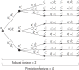

**********************************
Basics of model predictive control
**********************************

**Model predictive control (MPC)** is a control scheme
where a model is used for predicting the future behavior of the system over finite time window, the horizon.
Based on these predictions and the current measured/estimated state of the system,
the optimal control inputs with respect to a defined control objective and subject to system constraints is computed.
After a certain time interval, the measurement, estimation and computation process is repeated with a shifted horizon.
This is the reason why this method is also called **receding horizon control (RHC)**.

Major advantages of MPC in comparison to traditional **reactive** control approaches, e.g. PID, LQR, etc. are

* **Proactive control action**: The controller is anticipating future disturbances, set-points etc.

* **Non-linear control**: MPC can explicitly consider non-linear systems without linearization

* **Arbitrary control objective**: Traditional set-point tracking and regulation or economic MPC

* **constrained formulation**: Explicitly consider physical, safety or operational system constraints

.. image:: anim.gif

The MPC principle is visualized in the graphic above.
The dotted line indicates the current prediction and the solid line represents the realized values.
The graphic is generated using the innate plotting capabilities of **do-mpc**.

In the following, we will present the type of models, we can consider.
Afterwards, the (basic) **optimal control problem (OCP)** is presented.
Finally, **multi-stage NMPC**, the approach for robust NMPC used in **do-mpc** is explained.

System model
============

The system model plays a central role in MPC.
**do-mpc** enables the optimal control of continuous and discrete-time nonlinear and uncertain systems.
For the continuous case, the system model is defined by

.. math::

    \dot{x}(t) = f(x(t),u(t),z(t),p(t),p_{\text{tv}}(t)), \\
    y(t) = h(x(t),u(t),z(t),p(t),p_{\text{tv}}(t)),

and for the discrete-time case by

.. math::

    x_{k+1} = f(x_k,u_k,z_k,p_k,p_{\text{tv},k}), \\
    y_k = h(x_k,u_k,z_k,p_k,p_{\text{tv},k}).

The states of the systems are given by :math:`x(t),x_k`, the control inputs by :math:`u(t),u_k`,
algebraic states by :math:`z(t),z_k`, (uncertain) parameters by :math:`p(t),p_k`,
time-varying (but known) parameters by :math:`p_{\text{tv}}(t),p_{\text{tv},k}` and measurements by :math:`y(t),y_k`, respectively.
The time is denoted as :math:`t` for the continuous system and the time steps for the discrete system are indicated by :math:`k`.

Model predictive control problem
================================

For the case of continuous systems, trying to solve OCP directly is in the general case computationally intractable because it is an infinite-dimensional problem.
**do-mpc** uses a full discretization method, namely `orthogonal collocation`_,
to discretize the OCP.
This means, that both the OCP for the continuous and the discrete system result in a similar discrete OCP.

.. _`orthogonal collocation`: theory_orthogonal_collocation.html

For the application of MPC, the current state of the system needs to be known.
In general, the measurement :math:`y_k` does not contain the whole state vector, which means a state estimate :math:`\hat{x}_k` needs to be computed.
The state estimate can be derived e.g. via `moving horizon estimation`_.

.. _`moving horizon estimation`: theory_mhe.html

The OCP is then given by:

.. math::

    &\min_{\mathbf{x}_{0:N+1},\mathbf{u}_{0:N},\mathbf{z}_{0:N}} & & m(x_{N+1}) + \sum_{k=0}^{N} l(x_k,z_k,u_k,p_k,p_{\text{tv},k}) && \\
    &\text{subject to:} & & x_0 = \hat{x}_0, & \\
    &&& x_{k+1} = f(x_k,u_k,p_k,p_{\text{tv},k}), &\, \forall k=0,\dots,N,\\
    &&& g(x_k,u_k,p_k,p_{\text{tv},k}) \leq 0 &\, \forall k=0,\dots,N, \\
    &&& x_{\text{lb}} \leq x_k \leq x_{\text{ub}}, &\, \forall k=0,\dots,N, \\
    &&& u_{\text{lb}} \leq u_k \leq u_{\text{ub}}, &\, \forall k=0,\dots,N, \\
    &&& z_{\text{lb}} \leq z_k \leq z_{\text{ub}}, &\, \forall k=0,\dots,N, \\
    &&& g_{\text{terminal}}(x_{N+1}) \leq 0, &

where :math:`N` is the prediction horizon and :math:`\hat{x}_0` is the current state estimate,
which is either measured (state-feedback) or estimated based on an incomplete measurement (:math:`y_k`).

**do-mpc** allows to set upper and lower bounds for the states :math:`x_{\text{lb}}, x_{\text{ub}}`, inputs :math:`u_{\text{lb}}, u_{\text{ub}}` and algebraic states :math:`z_{\text{lb}}, z_{\text{ub}}`.
Terminal constraints can be enforced via :math:`g_{\text{terminal}}(\cdot)` and general nonlinear constraints can be defined with :math:`g(\cdot)`, which can also be realized as soft constraints.
The objective function consists of two parts, the mayer term :math:`m(\cdot)` which gives the cost of the terminal state and the lagrange term :math:`l(\cdot)` which is the cost of each stage :math:`k`.

.. _`moving horizon estimation`: theory_mhe.html

This formulation is the basic formulation of the OCP, which is solved by **do-mpc**.
In the next section, we will explain how **do-mpc** considers uncertainty to enable robust control.

.. note::
    Please be aware, that due to the discretization in case of continuous systems,
    a feasible solution only means that the constraints are satisfied point-wise in time.

Robust multi-stage NMPC
=======================
One of the main features of **do-mpc** is robust control, i.e. the control action satisfies the system constraints under the presence of uncertainty.
In particular, we apply the multi-stage approach which is described in the following.

General description
-------------------

The basic idea for the multi-stage approach is to consider various scenarios,
where a scenario is defined by one possible realization of all uncertain parameters at every control instant within the horizon.
The family of all considered discrete scenarios can be represented as a tree structure, called the scenario tree:

where one scenario is one path from the root node on the left side to one leaf node on the right, e.g. the state evolution for the first scenario :math:`S_4` would be :math:`x_0 \rightarrow x_1^2 \rightarrow x_2^4 \rightarrow \dots \rightarrow x_5^4`.
At every instant, the MPC problem at the root node :math:`x_0` is solved while explicitly taking into account the uncertain future evolution and the existence of future decisions, which can exploit the information gained throughout the evolution progress along the branches.
Through this design, feedback information is considered in the open-loop optimization problem, which reduces the conservativeness of the multi-stage approach.
Considering feedback information also means, that decisions :math:`u` branching from the same node need to be identical, because they are based on the same information, e.g. :math:`u_1^4 = u_1^5 = u_1^6`.

The system equation for a discretized/discrete system in the mutli-stage setting is given by:

.. math::

    x_{k+1}^j = f(x_k^{p(j)},u_k^j,z_k^{p(j)},p_k^{r(j)},p_{\text{tv},k}),

where the function :math:`p(j)`` refers to the parent state via :math:`x_k^{p(j)}` and the considered realization of the uncertainty is given by :math:`r(j)` via :math:`d_k^{r(j)}`.
The set of all occurring exponent/index pairs :math:`(i,j)` are denoted as :math:`I`.

Robust horizon
,,,,,,,,,,,,,,

Because the uncertainty is modeled as a collection of discrete scenarios in the multi-stage approach, every node branches into :math:`\prod_{1}^{n_p} v_{i}` new scenarios, where :math:`n_p` is the number of parameters and :math:`v_{i}` is the number of explicit values considered for the :math:`i`-th parameter.
This leads to an exponential growth of the scenarios with respect to the horizon.
To maintain the computational tractability of the multi-stage approach, the robust horizon :math:`N_{\text{robust}}` is introduced, which can be viewed as a tuning parameter.
Branching is then only applied for the first :math:`N_{\text{robust}}` steps while the values of the uncertain parameters are kept constant for the last :math:`N-N_{\text{robust}}` steps.
The number of considered scenarios is given by:

.. math::

    N_{\text{s}} = (\prod_{i=1}^{n_p} v_{i})^{N_{\text{robust}}}

This results in :math:`N_{\text{s}} = 9` scenarios for the presented scenario tree above instead of 243 scenarios, if branching would be applied until the prediction horizon.

The impact of the robust horizon is in general minor, since MPC is based on feedback.
This means the decisions are recomputed in every step after new information (measurements/state estimate) has been obtained and the branches are updated with respect to the current state.

.. note::

    It the uncertainties :math:`p` are unknown but constant, :math:`N_{\text{robust}}=1` is a common choice,
    because no branching of the scenario tree occurs after the first time instant (since the uncertainties are constant)
    and the computational load is kept minimal.

Mathematical formulation
------------------------

The formulation of the MPC problem for the multi-stage approach is given by:

.. math::

    & \min_{\mathbf{x}_{0:N}} &&\, \tilde{J} & \\
    &\text{subjet to} & & \, x_0 = \hat{x}_0 & \\
    &&& \, x_{k+1}^j = f(x_k^{p(j)},u_k^j,z_k^{p(j)},p_k^{r(j)},p_{\text{tv},k}) & \, \forall (j,k) \in I \\
    &&& u_k^i = u_k^j \text{ if }  x_k^{p(i)} = x_k^{p(j)}, & \, \forall (i,k), (j,k) \in I \\
    &&& g(x_k^{p(j)},u_k^j,z_k^{p(j)},p_k^{r(j)},p_{\text{tv},k}) \leq 0 & \, \forall (j,k) \in I \\
    &&& x_{\text{lb}} \leq x_k^j \leq x_{\text{ub}} & \, \forall (j,k) \in I \\
    &&& u_{\text{lb}} \leq u_k^j \leq u_{\text{ub}} & \, \forall (j,k) \in I \\
    &&& z_{\text{lb}} \leq z_k^j \leq z_{\text{ub}} & \, \forall (j,k) \in I \\
    &&& g_{\text{terminal}}(x_N^j,z_N^j) \leq 0     & \, \forall (j,N) \in I

where :math:`\tilde{J} = \left(\sum_{i=1}^{N}(\omega_i J_i)^{\alpha}\right)^{1/\alpha}` is the objective.
The objective consists of one term for each scenario, which can be weighted according to the probability of the scenarios :math:`\omega_i`, :math:`i=1,\dots,N_{\text{s}}`.
The cost for each scenario :math:`S_i` is given by:

.. math::

    J_i = m(x_N^j,z_N^j)  + \sum_{k=0}^{N} l(x_k^{p(j)},u_k^j,z_k^{p(j)},p_k^{r(j)},p_{\text{tv},k}).

For all scenarios, which are directly considered in the problem formulation, a feasible solution guarantees constraint satisfaction.
This means if all uncertainties can only take discrete values and those are represented in the scenario tree, constraint satisfaction can be guaranteed.

For linear systems if :math:`p_{\text{min}} \leq p \leq p_{\text{max}}`, considering the extreme values of the uncertainties in the scenario tree guarantees constraint satisfaction, even if the uncertainties are continuous and time-varying.
This design of the scenario tree for nonlinear systems does not guarantee constraint satisfaction for all :math:`p \in [p_{\text{min}}, p_{\text{max}}]`.
However, also for nonlinear systems the worst-case scenarios are often at the boundaries of the uncertainty intvervals :math:`[p_{\text{min}}, p_{\text{max}}]`.
In practice, considering only the extreme values for nonlinear systems provides good results.
