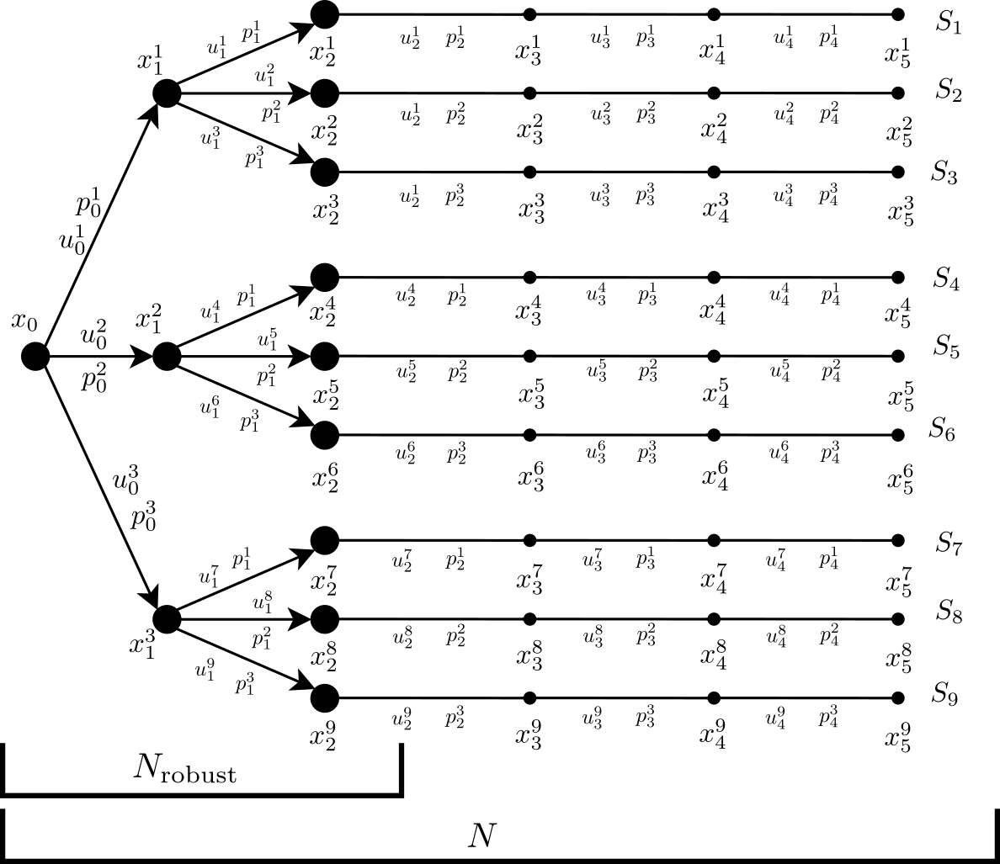

**********************************
Basics of model predictive control
**********************************

**Model predictive control (MPC)** is a control scheme where a model is used for predicting the behavior of the system for a finite time window, the horizon.
Based on these predictions and the current measured/estimated state of the system, the optimal control inputs with respect to the defined control objective and subject to system constraints is computed.
After a certain time interval, the measurement, estimation and computation process is repeated with a shifted horizon.
This is the reason why this method is also called **receding horizon control (RHC)**.

.. image:: anim.gif

The MPC principle is visualized in the above graphic.
The dotted line indicates the current prediction and the solid line represents the real values.
The graphic is generated using the innate plotting capabilities of **do-mpc**.

System model
============

The system model plays a central role in MPC.
**do-mpc** enables the optimal control of continuous and discrete-time nonlinear and uncertain systems.
For the continuous case, the system model is defined by

.. math::

    \dot{x}(t) = f(x(t),u(t),z(t),p(t),p_{\text{tv}}(t)), \\
    y(t) = h(x(t),u(t),z(t),p(t),p_{\text{tv}}(t)),

and for the discrete-time case by

.. math::

    x_{k+1} = f(x_k,u_k,z_k,p_k,p_{\text{tv},k}), \\
    y_k = h(x_k,u_k,z_k,p_k,p_{\text{tv},k}).

The state of the systems are given by :math:`x(t),x_k`, the control inputs by :math:`u(t),u_k`, algebraic states by :math:`z(t),z_k`, (uncertain) parameters by :math:`p(t),p_k`, time-varying parameters by :math:`p_{\text{tv}}(t),p_{\text{tv},k}` and measurements by :math:`y(t),y_k`, respectively.

Model predictive control problem
================================

For the application of MPC, the current state of the system needs to be known.
In general, the measurement :math:`y(t),y_k` does not contain the whole state vector, which means a state estimate :math:`\hat{x}(t),\hat{x}_k` needs to computed.
The state estimate can be derived e.g. via `moving horizon estimation`_.

.. _`moving horizon estimation`: theory_mhe.html

The state estimate can then be used in the **optimal control problem (OCP)** formulation:

.. math::

    & \min_{\mathbf{x}_{0:N},\mathbf{u}_{0:N-1}} & & J(x,u,p,p_{\text{tv}}) & \\
    & \text{subject to} & & x(0) = x_{\text{init}}, & \\
    &&& \dot{x}(t) = f(x(t),u(t),z(t),p(t),p_{\text{tv}}(t)) &\forall t \in [0,T], \\
    &&& x_{\text{lb}} \leq x(t) \leq x_{\text{ub}}, &\, \forall t \in [0,T], \\
    &&& u_{\text{lb}} \leq u(t) \leq u_{\text{ub}}, &\, \forall t \in [0,T], \\
    &&& z_{\text{lb}} \leq z(t) \leq z_{\text{ub}}, &\, \forall t \in [0,T], \\
    &&& g_{\text{terminal},x}(x(T)) \leq 0, & \\
    &&& g_{\text{terminal},z}(z(T)) \leq 0, &

for the continuous case, where ...
For the problem to be computationally tractable, discretization via  'orthogonal collocation'_.

.. _`orthogonal_collocation`: orthogonal_collocation.html

The discrete-time **OCP** is given by:

.. math::

    &\min_{\mathbf{x}_{0:N},\mathbf{u}_{0:N-1}} & & m(x_N,z_N,p_N,p_{\text{tv},N}) + \sum_{k=0}^{N-1} l(x_k,z_k,u_k,p_k,p_{\text{tv},k}) && \\
    &\text{subject to} & &\, x_0 = x_{\text{init}}, & \\
    &&& x_{k+1} = f(x_k,u_k,p_k,p_{\text{tv},k}), &\, \forall k=0,\dots,N-1,\\
    &&& g(x_k,u_k,p_k,p_{\text{tv},k}) \leq 0 &\, \forall k=0,\dots,N-1, \\
    &&& x_{\text{lb}} \leq x_k \leq x_{\text{ub}}, &\, \forall k=0,\dots,N-1, \\
    &&& u_{\text{lb}} \leq u_k \leq u_{\text{ub}}, &\, \forall k=0,\dots,N-1, \\
    &&& z_{\text{lb}} \leq z_k \leq z_{\text{ub}}, &\, \forall k=0,\dots,N-1, \\
    &&& g_{\text{terminal},x}(x_N) \leq 0, & \\
    &&& g_{\text{terminal},z}(z_N) \leq 0, &

where :math:`N` is the prediction horizon,
To ensure robust optimization, **multi-stage NMPC** (:ref:`quak`)  is applied.
Due to the discretization of the continuous-time dynamics, a feasible solution only means that the constraints are satisfied point-wise in time.

Robust multi-stage NMPC
=======================

For the sake of readability, in this part the discrete-time case is treated exclusively.
Please note, that for computational tractability, orthogonal collocation is applied to discretize the continuous-time system, hence resembles the discrete-time case.

The basic idea for the multi-stage approach is to consider various scenarios.
The family of scenarios can be represented as a tree structure, called the scenario tree:

In this exemplary tree, the control problem contains :math:`n_p=1` uncertain parameter :math:`p`, for which :math:`n_{v,1}` explicit values are considered.
The collection of child nodes
Explain scenario tree. Parent nodes, etc.
The constraints need to satisfied for all possible combinations of the constraints.
Each parent node branches :math:`\prod_{1}^{n_p} n_{v,i}` times within the robust horizon :math:`N_{\text{robust}}`.
For the last :math:`N-N_{\text{robust}}` steps the values of the uncertainties are kept constant.
This requirement is included in the formulation of the optimal control problem:

.. math::

    & \min_{\mathbf{x}_{0:N}} &&\, \sum \sum l(x_k,u_k,z_k,p_k,p_{\text{tv},k}) & \\
    &\text{subjet to} & & \, x_0 = \hat{x}_k & \\
    &&& \, x_{k+1}^{\dots,i,j} = f(x_k^{\dots,i},u_k^{\dots,i},z_k^{\dots,i},p_k^i,p_{\text{tv},k})

For all the scenario, which are directly considered in the problem formulation, constraint satisfaction can be guaranteed.
For nonlinear problems, constraint satisfaction cannot be guaranteed for all possible combinations of the parameters within the uncertainty interval, if the uncertainties are continuous.
However, often the worst-case scenarios are at the boundaries of the intervals of the uncertain parameters.
So, if the boundaries are considered in the scenario tree, constraint satisfaction for all cases is highly probable.

Due to the tree structure of the multi-stage approach, the number of scenarios grows exponentially with the prediction horizon :math:`N`.
To reduce the computational load, the robust horizon :math:`N_{\text{robust}} \leq N` is introduced.
Hence, the number of considered scenarios is given by:

.. math::

    N_{\text{s}} = (\prod_{i=1}^{n_p} n_{v,i})^{N_{\text{robust}}}

where :math:`n_p` is the number of parameters and :math:`n_{v,i}` is the number of explicit values considered for the :math:`i`-th parameter.
